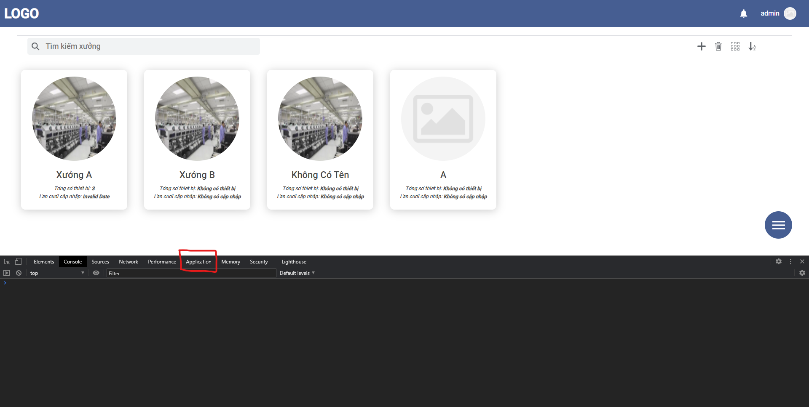
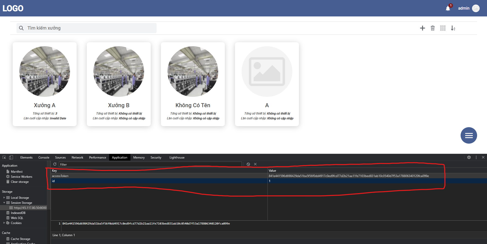

# Lấy accessToken và id của tài khoản
#### Bước 1: Đăng ký tại trang: https://www.vhie.tk/register
#### Bước 2: Sau khi đăng ký và đăng nhập thành công. Ấn F12 ta sẽ được bảng console như hình dưới đây

### Bước 3: Chuyển sang tab Application của console và chỉ đến phần Session Storage như hình dưới

# Lấy danh sách thiết bị
#### URL:
```bash
https://www.vhie.tk/api/get/devices
```
#### Request body:
```JSON
{
   "id": "1",
   "accessToken": "841e441596d698429da51ba5f56f0dd4917c0ed9fcd77d2b21aa11fe7103bed831ab10c0540d7f53a178806340120fca099e"
}
```
#### Response: ( devices sẽ là mảng chứa id của các thiết bị )
```JSON
{
    "status": true,
    "error": null,
    "devices": ["1","2","3","4","5"]
}
```
# Lấy dữ liệu của thiết bị

#### URL:
```bash
https://www.vhie.tk/api/get/device/:device_id
```
#### Request body:
```JSON
{
   "accessToken": "841e441596d698429da51ba5f56f0dd4917c0ed9fcd77d2b21aa11fe7103bed831ab10c0540d7f53a178806340120fca099e"
}
```
#### Response: ( Các thông số TIn, TOut, HIn, HOut, LogC, LogE sẽ chứa thời gian trong 1 tháng)
```JSON
{
    "status": true,
    "error": null,
    "data": {
        "dev_id": "12345002",
        "TIn": {
            "12/18/2020, 11:01:11 PM": 30,
            "12/19/2020, 11:25:02 AM": 29
        },
        "TOut": {
            "12/18/2020, 11:01:11 PM": 24,
            "12/19/2020, 11:25:02 AM": 24
        },
        "HIn": {
            "12/18/2020, 11:01:11 PM": 0,
            "12/19/2020, 11:25:02 AM": 0
        },
        "HOut": {
            "12/18/2020, 11:01:11 PM": 0,
            "12/19/2020, 11:25:02 AM": 0
        },
        "LogE": {
            "12/18/2020, 11:01:14 PM": 10505,
            "12/19/2020, 11:25:08 AM": 10513
        },
        "LogC": {
            "12/18/2020, 11:01:14 PM": 172476,
            "12/19/2020, 11:25:08 AM": 172624
        },
        "Tr1": 35,
        "Tr2": 35,
        "Tr3": 35,
        "AirT": 28,
        "Phone": {},
        "VolS": 0,
        "SmoS": 0,
        "WatS": 1,
        "DooS": 0,
        "CoolS": 0,
        "F1": 0,
        "F2": 0,
        "F3": 0,
        "SysS": 1
    }
}
```

#### URL:
```bash
https://www.vhie.tk/api/set/device/:device_id
```
#### Request body: (Có thể gửi 1 hoặc nhiều tham số 1 lúc)
```JSON
{
   "accessToken": "841e441596d698429da51ba5f56f0dd4917c0ed9fcd77d2b21aa11fe7103bed831ab10c0540d7f53a178806340120fca099e",
   "data":{
      "AirT":999,
      "Tr1":999,
      "Tr2":999,
      "Tr3":999,
      "F1":1,
      "F2":1,
      "F3":1,
      "OnOff":1
   }
}
```
#### Response:
```JSON
{
    "status": true,
    "error": null
}
```
